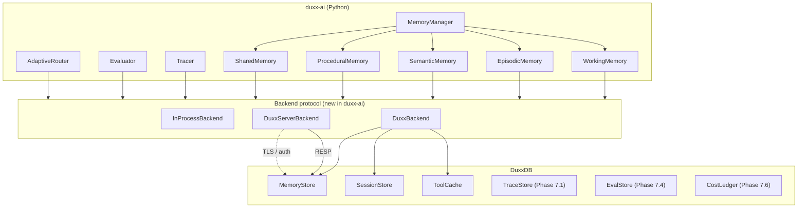
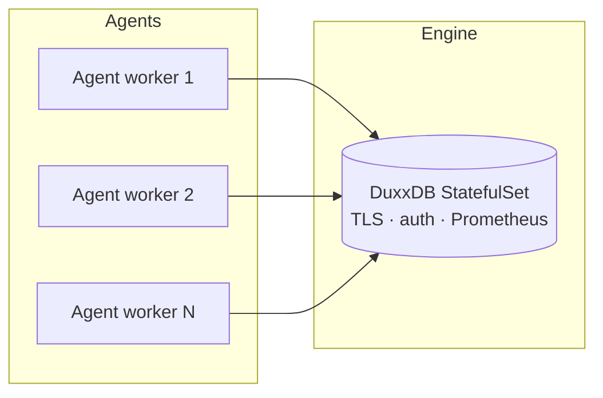

# Duxx Stack Integration — `duxx-ai` + DuxxDB

How the two repos plug together. Living design doc — edit as the
implementation lands.

| | Repo | Lang | Role | Today |
|---|---|---|---|---|
| **Framework** | [bankyresearch/duxx-ai](https://github.com/bankyresearch/duxx-ai) | Python | Agents, Crew, Tools, MemoryManager, Governance, Observability | v0.30.0 (alpha, very active) |
| **Engine** | [bankyresearch/duxxdb](https://github.com/bankyresearch/duxxdb) | Rust | Storage, hybrid recall, RESP/gRPC/MCP servers, persistence | v0.1.0 (this repo) |

---

## Contents

- [Current state](#current-state)
- [Target integration](#target-integration)
- [Phase A — Memory backend swap (this week)](#phase-a--memory-backend-swap-this-week)
- [Phase B — Trace integration (Phase 7.1)](#phase-b--trace-integration-phase-71)
- [Phase C — Prompts / Eval / Cost (Phase 7.2 – 7.6)](#phase-c--prompts--eval--cost-phase-72--76)
- [API contracts](#api-contracts)
- [Deployment shapes](#deployment-shapes)

---

## Current state

What `duxx-ai` ships **today** (read from `duxx_ai/memory/manager.py`):

```python
class MemoryEntry(BaseModel):
    id: str                   # uuid4
    content: str
    memory_type: str          # working | episodic | semantic | procedural | shared
    agent_id: str = ""
    timestamp: float
    metadata: dict[str, Any]
    embedding: list[float]    # already there
    importance: float = 0.5
    access_count: int = 0
    last_accessed: float
    ttl: float | None = None

class WorkingMemory:           # dict + LRU eviction, no persistence
class EpisodicMemory:          # list + optional JSON-file save/load
class SemanticMemory:          # similar
class ProceduralMemory:        # similar
class SharedMemory:            # similar
class MemoryManager:           # orchestrates the five tiers
```

What DuxxDB ships **today** (read from `crates/duxx-memory/src/lib.rs`):

```rust
pub struct Memory {
    pub id: u64,
    pub key: String,            // ≈ agent_id / namespace
    pub text: String,           // ≈ content
    pub embedding: Vec<f32>,
    pub importance: f32,
    pub created_at_unix_ns: u128,
}

impl MemoryStore {
    pub fn remember(&self, key, text, embedding) -> Result<u64>;
    pub fn recall(&self, key, query, query_vec, k) -> Result<Vec<RecallHit>>;
    pub fn recall_decayed(&self, key, query, query_vec, k, half_life) -> ...;
    pub fn set_max_rows(&self, cap: Option<usize>);
    pub fn open_at(dim, capacity, dir) -> Result<Self>;  // dir: persistence
}
```

**Observation:** The two type shapes already align. `MemoryEntry`
maps almost 1:1 to DuxxDB's `Memory`. The biggest gap on the duxx-ai
side is the lack of a real recall index — it's a Python list/dict
right now. Wiring DuxxDB in unlocks sub-ms hybrid recall + persistence.

---

## Target integration



Three swappable backends behind one protocol:

- `InProcessBackend` — current Python dict + JSON file behavior. Stays
  the default for `pip install duxx-ai` so a fresh user gets working
  code without external dependencies.
- `DuxxBackend` — uses the `duxxdb` Python wheel (`pip install duxxdb`).
  Same Python process, embedded DuxxDB. Sub-ms recall, persistent if
  `storage="dir:./path"` is passed.
- `DuxxServerBackend` — talks to a `duxx-server` daemon over RESP.
  Default for fleets / production. Auth + TLS + Prometheus all flow
  through DuxxDB's existing surface.

---

## Phase A — Memory backend swap (this week)

### A1. Define the protocol in `duxx-ai`

```python
# duxx_ai/memory/storage/backend.py  (new file)
from __future__ import annotations
from typing import Protocol, runtime_checkable
from duxx_ai.memory.manager import MemoryEntry


@runtime_checkable
class MemoryBackend(Protocol):
    """Pluggable backend for MemoryManager and the five tier stores.

    Every method is sync (the protocol matches today's MemoryManager).
    An async variant ships in v0.31."""

    def store(self, entry: MemoryEntry) -> str:
        """Insert an entry. Returns its id (may be assigned by backend)."""

    def get(self, id: str) -> MemoryEntry | None:
        """Point lookup. None if not found or expired."""

    def recall(
        self,
        query: str,
        *,
        agent_id: str | None = None,
        memory_type: str | None = None,
        k: int = 10,
        query_embedding: list[float] | None = None,
    ) -> list[MemoryEntry]:
        """Hybrid recall.
        - If query_embedding is provided, used as the vector. Otherwise
          the backend may embed `query` itself.
        - agent_id and memory_type are filter scopes.
        - Backend returns at most `k` hits, ordered by score desc."""

    def delete(self, id: str) -> bool:
        """Remove an entry. Returns True if it existed."""

    def stats(self) -> dict[str, int]:
        """Operational counters: count, evictions, bytes_used, ..."""
```

### A2. Three implementations

```python
# duxx_ai/memory/storage/in_process.py — refactor of today's dict + JSON
class InProcessBackend(MemoryBackend): ...

# duxx_ai/memory/storage/duxx_local.py — uses pip-installed duxxdb
class DuxxBackend(MemoryBackend):
    def __init__(
        self,
        *,
        dim: int = 1536,
        capacity: int = 100_000,
        storage: str | None = None,           # None=in-memory, "dir:./path"=persistent
        max_memories: int | None = None,
        embedder: Callable[[str], list[float]] | None = None,
    ):
        import duxxdb
        if storage and storage.startswith("dir:"):
            self._store = duxxdb.MemoryStore.open_at(
                dim=dim, capacity=capacity, dir=storage[4:])
        else:
            self._store = duxxdb.MemoryStore(dim=dim, capacity=capacity)
        if max_memories:
            self._store.set_max_rows(max_memories)
        self._embedder = embedder  # if None: caller must provide
                                   # query_embedding to recall().

    def store(self, entry: MemoryEntry) -> str:
        emb = entry.embedding or (self._embedder(entry.content) if self._embedder else None)
        if emb is None:
            raise ValueError("embedding not provided and no embedder configured")
        key = entry.agent_id or "default"
        new_id = self._store.remember(key=key, text=entry.content, embedding=emb)
        return str(new_id)

    def recall(self, query, *, agent_id="default", k=10, query_embedding=None, **kw):
        emb = query_embedding or (self._embedder(query) if self._embedder else None)
        if emb is None:
            raise ValueError("embedding not provided and no embedder configured")
        hits = self._store.recall(key=agent_id, query=query, embedding=emb, k=k)
        return [self._hit_to_entry(h) for h in hits]
    ...

# duxx_ai/memory/storage/duxx_server.py — talks to duxx-server over RESP
class DuxxServerBackend(MemoryBackend):
    def __init__(self, url: str, *, dim: int = 1536, embedder=None):
        import redis
        self._client = redis.from_url(url, decode_responses=True)
        self._dim = dim
        self._embedder = embedder

    def store(self, entry):
        # RESP: REMEMBER key text
        key = entry.agent_id or "default"
        new_id = self._client.execute_command("REMEMBER", key, entry.content)
        return str(new_id)

    def recall(self, query, *, agent_id="default", k=10, **kw):
        rows = self._client.execute_command("RECALL", agent_id, query, k)
        # RESP returns [[id, score, text], ...]
        return [self._row_to_entry(r) for r in rows]
    ...
```

### A3. Refactor `MemoryManager` to take a backend

```python
# duxx_ai/memory/manager.py — minimal diff
class MemoryManager:
    def __init__(
        self,
        backend: MemoryBackend | None = None,
        agent_id: str = "default",
        **legacy_kwargs,
    ):
        self.backend = backend or InProcessBackend()
        self.agent_id = agent_id

        # Each tier becomes a thin namespace prefix over the backend.
        # No more separate dicts/lists -- one source of truth.
        self.working    = TierProxy(self.backend, agent_id, "working")
        self.episodic   = TierProxy(self.backend, agent_id, "episodic")
        self.semantic   = TierProxy(self.backend, agent_id, "semantic")
        self.procedural = TierProxy(self.backend, agent_id, "procedural")
        self.shared     = TierProxy(self.backend, agent_id, "shared")
```

The five `WorkingMemory` / `EpisodicMemory` / etc. classes collapse
into one `TierProxy` that just passes `memory_type="working"` (etc.)
to the backend.

### A4. End-user surface stays clean

```python
# Today (still works after the swap, just slower):
from duxx_ai import MemoryManager
mm = MemoryManager()                        # default: InProcessBackend

# This week (one extra import):
from duxx_ai.memory.storage import DuxxBackend
mm = MemoryManager(backend=DuxxBackend(
    dim=1536,
    storage="dir:./.duxxdb",
    max_memories=100_000,
    embedder=openai_embedder,
))

# Production (multi-agent fleet):
from duxx_ai.memory.storage import DuxxServerBackend
mm = MemoryManager(backend=DuxxServerBackend(
    url="rediss://:$DUXX_TOKEN@duxxdb.example.com:6379",
    embedder=openai_embedder,
))
```

### A5. Tests

- `InProcessBackend`: keep existing tests, they still pass
- `DuxxBackend`: 5 integration tests against the wheel — store/recall
  round-trip, persistence across reopen, eviction enforcement, decay
- `DuxxServerBackend`: 3 integration tests with a Docker-managed
  `duxx-server` in CI

### A6. Effort

- Protocol + 3 backends + TierProxy refactor: **~3 days**
- Tests + docs: **~1 day**
- Total: **~1 working week** to ship the swap in duxx-ai 0.31.

---

## Phase B — Trace integration (Phase 7.1)

Once DuxxDB ships `duxx-trace` (Span / Trace / Thread primitives +
OTLP ingest), duxx-ai's `observability/tracer.py` gains a backend
swap:

```python
# duxx_ai/observability/tracer.py
class Tracer:
    def __init__(self, backend: TraceBackend | None = None):
        self.backend = backend or InProcessTraceBackend()

class DuxxTraceBackend(TraceBackend):
    """Flush every span to DuxxDB. Persistent, queryable, MCP-visible."""
    def record_span(self, span): ...
    def close_span(self, span_id, end_ns, status): ...
    def get_trace(self, trace_id): ...
```

duxx-ai's existing tracer keeps spans in a Python deque; the
DuxxTraceBackend forwards them to DuxxDB's `TRACE.RECORD` command via
RESP. Spans persist; thread reconstruction; tree-aware queries; live
tail via `PSUBSCRIBE trace.*`.

---

## Phase C — Prompts / Eval / Cost (Phase 7.2 – 7.6)

Same pattern. Each DuxxDB primitive ships with a duxx-ai adapter:

| DuxxDB feature | duxx-ai surface | What user gains |
|---|---|---|
| `PROMPT.PUT/GET/LIST/RECALL` | `duxx_ai.prompts.PromptRegistry` (today's prompt strings move into versioned registry) | Versioning, A/B routing, semantic search across prompts |
| `EVAL.RUN/SCORE` | `duxx_ai.observability.evaluator` becomes a thin client to DuxxDB EvalStore | Persistent eval history, regressions, cross-eval semantic search |
| `COST.RECORD/QUERY/SETBUDGET` | `duxx_ai.router.AdaptiveRouter` writes to DuxxDB CostLedger | Real cost ledger, budgets, alerts, attribution |
| `DATASET.CREATE/ADD` | `duxx_ai.datasets` (new module) | Versioned datasets shared between agents |

Each integration is ~2 days of Python wrapper after the Rust primitive
ships.

---

## API contracts

For each integration point, freeze the wire format here so both repos
can ship independently.

### Memory recall — Python adapter calls

```python
# duxx-ai side
backend.recall(
    query="user wants refund",
    agent_id="alice",
    memory_type="episodic",
    k=5,
    query_embedding=[...]  # length must match dim
)
# returns: list[MemoryEntry]
```

### Memory recall — RESP (DuxxServerBackend → duxx-server)

```
> AUTH <DUXX_TOKEN>
+OK
> REMEMBER alice "I lost my wallet at the cafe"
:1
> RECALL alice "wallet" 5
1) 1) (integer) 1
   2) "0.032787"
   3) "I lost my wallet at the cafe"
```

### Trace record — Python adapter calls (Phase B)

```python
backend.record_span(Span(
    trace_id="abc-...",
    span_id="def-...",
    parent_span_id="...",
    name="llm.openai.completion",
    start_unix_ns=...,
    attributes={"model": "gpt-4o", "tokens_in": 421},
))
```

### Trace record — RESP (Phase B)

```
> TRACE.RECORD <trace_id> <span_id> <parent> <name> <attrs_json> [<start_ns> [<end_ns> [<status>]]]
+OK
```

---

## Deployment shapes

Three patterns, increasing in scale:

### 1. Local dev (`InProcessBackend` or `DuxxBackend`)

```python
mm = MemoryManager(backend=DuxxBackend(storage=None))  # in-memory
# OR
mm = MemoryManager(backend=DuxxBackend(storage="dir:./.duxxdb"))
```

Single Python process, DuxxDB embedded. Zero extra ops surface.

### 2. Sidecar (`DuxxServerBackend` against a local daemon)

```bash
# Sidecar container in the same pod / docker-compose:
docker run -d --name duxxdb \
  -v duxxdb-data:/var/lib/duxxdb \
  -e DUXX_STORAGE=dir:/var/lib/duxxdb \
  -e DUXX_TOKEN=$TOKEN \
  ghcr.io/bankyresearch/duxxdb:latest
```

```python
mm = MemoryManager(backend=DuxxServerBackend(
    url=f"redis://:{TOKEN}@localhost:6379"))
```

Survives the Python process crashing. Still single-tenant.

### 3. Fleet (`DuxxServerBackend` against a shared daemon)



```python
# All workers share state:
mm = MemoryManager(backend=DuxxServerBackend(
    url="rediss://:$TOKEN@duxxdb.example.com:6379",
    agent_id=os.environ["AGENT_ID"]))
```

DuxxDB k8s manifest in `packaging/k8s/duxxdb.yaml`. Multi-tenant lands
in DuxxDB Phase 6.3+ (one daemon per tenant works today).

---

## Open questions

| Question | Likely answer |
|---|---|
| Where does the embedder live — in duxx-ai or in DuxxDB? | duxx-ai (already has model-routing infra). DuxxDB stays pure storage + retrieval. |
| Sync vs async API? | Sync for v0.31. Async wrapper in v0.32. |
| Does duxx-ai own a hosted SaaS too, or is that DuxxDB Cloud? | DuxxDB Cloud (Phase B in the SaaS plan). duxx-ai is OSS-only forever. |
| Versioning policy across the two repos? | Both semver. duxx-ai pins a compatible DuxxDB range in pyproject.toml. |
| What about non-Python agents? | DuxxDB's RESP / gRPC / MCP surfaces serve them directly; duxx-ai is the Python-only adapter. |

---

## Status

| Phase | Status |
|---|---|
| **A1.** MemoryBackend protocol | proposed |
| **A2.** InProcessBackend + DuxxBackend + DuxxServerBackend | proposed |
| **A3.** MemoryManager refactor | proposed |
| **A4.** End-user `from duxx_ai.memory.storage import DuxxBackend` | proposed |
| **A5.** Tests | proposed |
| **B.** Trace integration | blocked on DuxxDB Phase 7.1 |
| **C.** Prompts / Eval / Cost | blocked on DuxxDB Phase 7.2 – 7.6 |

When the first item flips to `shipped`, link the PR here.
