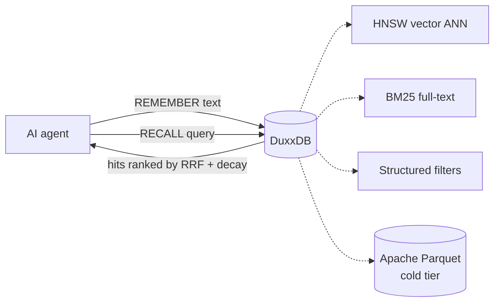
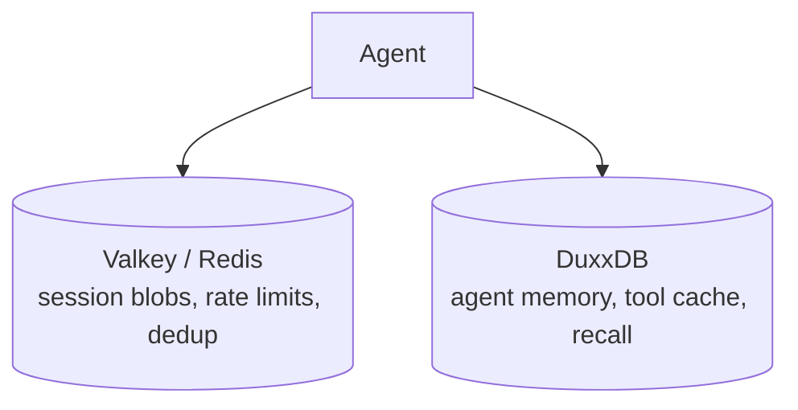
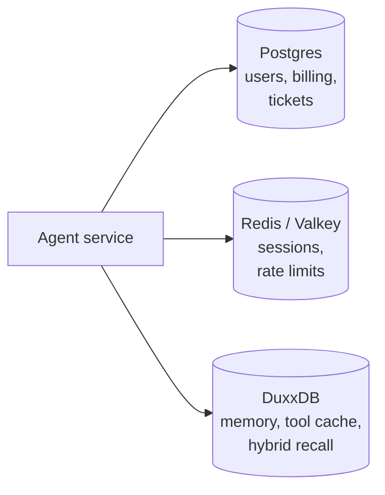
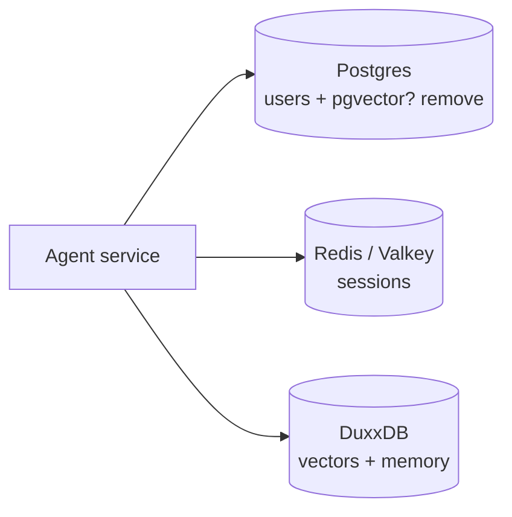

# DuxxDB — FAQ

Short, opinionated answers. For the long form see
[PROJECT_OVERVIEW.md](PROJECT_OVERVIEW.md). For wiring recipes per
agent shape see [INTEGRATION_GUIDE.md](INTEGRATION_GUIDE.md).

---

## Table of contents

- [What is DuxxDB?](#what-is-duxxdb)
- [When is DuxxDB the right choice?](#when-is-duxxdb-the-right-choice)
- [When is DuxxDB the wrong choice?](#when-is-duxxdb-the-wrong-choice)
- [How does it compare to …?](#how-does-it-compare-to-)
- [Does it work with my LLM provider?](#does-it-work-with-my-llm-provider)
- [Does it work with my framework?](#does-it-work-with-my-framework)
- [Can I run it alongside Postgres / Redis I already have?](#can-i-run-it-alongside-postgres--redis-i-already-have)
- [How do I migrate from pgvector / Pinecone / Qdrant?](#how-do-i-migrate-from-pgvector--pinecone--qdrant)
- [Operational](#operational)
- [Security](#security)
- [Performance & scale](#performance--scale)
- [Licensing](#licensing)

---

## What is DuxxDB?

A pure-Rust, embedded-or-server hybrid database that natively
understands **agent memory**, fuses **vector + full-text + structured**
retrieval in a single query plan, and runs in-process or as a
RESP/gRPC/MCP server from the same codebase.

In one diagram:

One store. Six integration surfaces (Rust crate, Python wheel, Node
module, RESP TCP, gRPC, MCP stdio). Apache 2.0.

---

## When is DuxxDB the right choice?

✅ You're **building an agent and starting fresh**, and you'd otherwise
be standing up Redis (sessions) + Qdrant/Pinecone (vectors) +
Postgres (facts) and writing glue between them.

✅ You need **sub-millisecond hybrid recall** (vector + BM25 +
structured filters fused in one query plan). Voice bots with a 200 ms
total turn budget, or chat with snappy "agent felt instant" UX.

✅ You want **importance decay** for long-running memory (days/weeks/
months). Most stores treat this as a client-side concern; DuxxDB has
it as a first-class type.

✅ You want **MCP-native** wire protocol so Claude Desktop / Cline /
Cursor / any MCP agent plugs in zero-glue.

✅ You want **embedded mode** (in-process, no server) for an edge
deployment, an offline app, or a unit test that needs a real store.

✅ You want a **single Apache 2.0 binary** instead of a multi-vendor
stack with mixed licenses (Pinecone proprietary, Redis RSALv2/SSPL,
etc.).

---

## When is DuxxDB the wrong choice?

❌ You already have a **production Postgres + pgvector** that works
fine. Don't migrate just for benchmarks. DuxxDB shines when you'd
otherwise be running 2–3 stores; if you're already at 1, the win is
smaller.

❌ You need **sharded / multi-master / multi-region** — that's Phase
6.3+. Today DuxxDB is single-node (run one daemon per tenant if you
need isolation).

❌ You need **mature SQL** for analytics. DuxxDB's structured filters
are agent-friendly but not a Postgres replacement for joins, window
functions, CTEs, etc. Use DuxxDB for the agent path, Postgres for the
analytics / business path. See [coexistence pattern](INTEGRATION_GUIDE.md#coexistence-keep-postgres--add-duxxdb).

❌ You need **mTLS / per-key RBAC / row-level security**. Phase 6.3+.
Today DuxxDB has a single shared bearer/AUTH token per daemon.

❌ You're indexing **billions of vectors** in a single table.
hnsw_rs scales well, but at that point you're shopping for Milvus /
Vespa-class systems with explicit shard management.

---

## How does it compare to …?

### vs. Pinecone / Qdrant / Milvus / Weaviate (vector DBs)

| | Pinecone / Qdrant / Milvus / Weaviate | DuxxDB |
|---|---|---|
| Vector ANN | ✅ | ✅ (HNSW) |
| BM25 full-text **in the same query plan** | ⚠ separate index, separate call | ✅ RRF-fused in one round-trip |
| Structured filters | ⚠ per vendor | ✅ |
| Embedded mode | ✗ | ✅ |
| Agent primitives (`MEMORY`, `TOOL_CACHE`, `SESSION`) | ✗ | ✅ |
| Importance decay | client-side | ✅ first-class |
| MCP-native | ✗ | ✅ |
| License | mixed (Pinecone proprietary, others Apache/BSD) | Apache 2.0 |

When to pick a pure vector DB: you genuinely need a billion+ vectors
in a single index, you're already on their hosted plan, or you have
an existing investment.

### vs. Redis / Valkey / DiceDB (KV with reactive)

DuxxDB doesn't try to replace these for raw KV. Valkey is the OSS
default for "fast distributed KV with pub/sub". Use **both**:

DuxxDB even **speaks RESP** so you can repoint clients without
rewriting code. See [coexistence pattern](INTEGRATION_GUIDE.md#coexistence-with-redis--valkey).

### vs. Postgres + pgvector

If you're already heavily on Postgres, pgvector is the path of least
resistance — the same store handles users, billing, vectors, the
lot. DuxxDB wins when:

- you need hybrid (vector + BM25) and don't want to bolt FTS on top.
- you need agent primitives + importance decay.
- you need an embedded mode for edge / offline.
- you don't already pay the Postgres operational cost.

You can also **coexist** — Postgres for OLTP, DuxxDB for the agent
path. See [INTEGRATION_GUIDE.md § 7](INTEGRATION_GUIDE.md#coexistence-keep-postgres--add-duxxdb).

### Library-level memory abstractions in agent frameworks

In-framework memory layers are typically thin wrappers over whatever
store you point them at. DuxxDB is designed to be that store: it
exposes the primitives (vector + BM25 hybrid recall, importance
decay, sessions, tool cache) those wrappers need, with sub-ms
latency and a single binary deployment story.

---

## Does it work with my LLM provider?

DuxxDB is **provider-agnostic**. It stores text + a vector you give
it. The vector can come from anywhere:

- **OpenAI** — built-in `openai:text-embedding-3-small` / `-3-large`
  embedder. Set `OPENAI_API_KEY`, pass `--embedder openai:...`.
- **Cohere** — built-in `cohere:embed-english-v3.0`. Set
  `COHERE_API_KEY`, pass `--embedder cohere:...`.
- **Anthropic** — Anthropic doesn't ship a public embedding API
  today. Use OpenAI or a local model for embeddings; use Anthropic
  for generation.
- **Local** (BGE, GTE, sentence-transformers, ollama, llama.cpp) —
  embed in your application code, pass the `Vec<f32>` directly to
  `MemoryStore::remember(key, text, vec)`.
- **Hash** (default) — deterministic 32-d toy embedder for tests /
  demos. Don't use in production.
- **Bring your own** — implement the `Embedder` trait
  (`fn embed(&self, text: &str) -> Vec<f32>`) for any model.

The **generation** model (the one writing replies) is whichever your
framework uses — DuxxDB sits behind it.

---

## Does it work with my framework?

| Ecosystem | How |
|---|---|
| **RESP-compatible clients (any language)** | Point any Redis client at `duxx-server`. Chat history via RESP lists; recall via the `RECALL` command. |
| **Python agent frameworks** | Use the RESP server, the gRPC client, or the embedded `duxxdb` Python wheel. Memory and chat-history wrappers in popular frameworks plug straight into RESP. |
| **Node agent toolkits** | Use the Node binding (`bindings/node`) or the RESP server with `node-redis`. |
| **OpenAI Assistants API** | Doesn't expose memory primitives — keep memory in DuxxDB and pass relevant snippets in the prompt. |
| **Claude Desktop / Cline / Cursor** (MCP) | Point at `duxx-mcp` in the MCP config. Zero glue code. See [INTEGRATION_GUIDE.md § 5](INTEGRATION_GUIDE.md#mcp--claude-desktop--cline--cursor). |
| **Voice stacks (Pipecat / LiveKit / Vapi)** | Use as the memory layer. See [INTEGRATION_GUIDE.md § 4](INTEGRATION_GUIDE.md#voice-bot-with-pipecat--livekit). |
| **Custom (no framework)** | Direct RESP, gRPC, or embedded crate. |

Anything that talks **Redis** talks **DuxxDB** (RESP wire-compatible).
That alone covers most agent stacks.

---

## Can I run it alongside Postgres / Redis I already have?

Yes — and that's often the right design. Two clean patterns:

### "Add DuxxDB next to existing infra"

Use what you have for what it's good at. DuxxDB owns the **agent
path** (memory, recall, tool caching) and nothing else.

### "DuxxDB replaces the vector DB only"

Keep Postgres for SQL; replace pgvector / your separate vector DB
with DuxxDB. Migration recipe in
[INTEGRATION_GUIDE.md § 6](INTEGRATION_GUIDE.md#migration-pgvector--duxxdb).

---

## How do I migrate from pgvector / Pinecone / Qdrant?

Three steps regardless of source store:

1. **Dump** rows + embeddings from the old store (SQL `SELECT` /
   Pinecone fetch / Qdrant scroll API).
2. **Load** them into DuxxDB via RESP `REMEMBER` (one row at a time)
   or `MemoryStore::remember` (embedded, batchable).
3. **Cut over** the agent's read path; keep dual-write for a window
   if you want safety.

Concrete recipes per source: [INTEGRATION_GUIDE.md § 6](INTEGRATION_GUIDE.md#migrations).

---

## Operational

### How do I deploy it?

Postgres-style: pick your platform, follow the recipe in
[INSTALLATION.md](INSTALLATION.md). Docker is the fast path; .deb /
brew / k8s manifests / one-line installer all available.

### Backups?

Periodic Apache Parquet snapshot via `duxx-export`, then ship to
S3 / GCS / Azure. Restore by reading the Parquet file back into
`MemoryStore`. See [USER_GUIDE.md § 6](USER_GUIDE.md#6-backup--restore).

### Replication?

Single-node today. Replicate at the orchestration layer (k8s
StatefulSet with one replica + a periodic Parquet dump). Active
replication lands in Phase 6.3+.

### Memory pressure?

Set `--max-memories N`. Phase 6.2 evicts the lowest *effective
(decayed) importance* row first — agent-friendly forgetting. See
[USER_GUIDE.md § 5](USER_GUIDE.md#5-going-to-production).

### How do I monitor it?

Phase 6.1 ships a Prometheus `/metrics` endpoint and a `/health`
endpoint on a separate port. Counters for connections / commands /
errors / evictions; gauges for memory + session counts; histograms
for per-command latency. gRPC also exposes
`grpc.health.v1.Health/Check` for k8s probes.

### What about logging?

Standard `tracing` output to stderr. Set `RUST_LOG=info` (or `debug`
for diagnostics). systemd-journal / Docker / k8s collect it
unchanged.

---

## Security

### Auth?

Token-based. `--token TOKEN` (or `DUXX_TOKEN` env). RESP requires
`AUTH <token>` before any non-PING command. gRPC requires
`x-duxx-token: <token>` metadata on every RPC. Constant-time compare
on both sides.

### TLS?

Native (Phase 6.2). `--tls-cert PATH --tls-key PATH` on both
`duxx-server` and `duxx-grpc`. rustls — pure Rust, no OpenSSL.
`redis-cli --tls`, `grpcurl`, any rustls / OpenSSL client connects
directly.

### mTLS / per-key RBAC?

Phase 6.3+.

### Sensitive data — PII, PHI?

DuxxDB stores whatever text you give it. The store itself doesn't
classify or redact. If your data is regulated:

- Encrypt at rest at the filesystem layer (LUKS / dm-crypt / your
  cloud's volume encryption).
- Use Phase 6.2 native TLS for the wire.
- Pin DuxxDB to a private network; expose only behind a load
  balancer / ingress with auth.
- Use the `--max-memories` cap + your own retention policy via
  cron-driven eviction of old data.

### Compliance (HIPAA / SOC2 / GDPR)?

DuxxDB is software, not a service — compliance is a property of
**your deployment**, not of DuxxDB itself. Apache 2.0 means you can
run it inside any compliant environment.

---

## Performance & scale

### How fast?

Median hybrid recall on a single thread:

| Corpus | Latency |
|---:|---:|
| 100 docs | 123 µs |
| 1 000 docs | 166 µs |
| 10 000 docs | 373 µs |

Even over a localhost gRPC round-trip (Python client, dim 128, N=1k):
recall p50 = **2.4 ms** — **30× faster** than embedded LanceDB on the
same workload. Full numbers + caveats in [`bench/comparative/`](../bench/comparative/).

### How big?

Tested up to 100k vectors in CI; the in-memory store is happy at
1M+ with a tuned HNSW capacity and enough RAM. Beyond that you want
sharding (Phase 6.3+).

### What about cold start?

`dir:` storage with graceful shutdown takes the fast path: tantivy +
HNSW are loaded from disk, not rebuilt — typically sub-second for
100k memories. Hard kills fall back to the row-rebuild path
(seconds → minutes proportional to corpus size).

### CPU vs memory?

HNSW + tantivy live in RAM. Budget ~1 KB per memory for HNSW edges
+ tantivy postings + the embedding itself (dim × 4 bytes for f32).
For a million 1536-d memories that's ~6 GB RAM. Use
`--max-memories` to cap.

---

## Licensing

### What license?

Apache License 2.0. No "open core" tax. The whole stack — every
crate, every binding, every binary — is the same Apache 2.0 license.

### Can I use it commercially?

Yes. Apache 2.0 is a permissive license. You can:

- Run DuxxDB inside a commercial product.
- Modify it and ship the modified version.
- Sell support / hosting / managed offerings.

What you must keep: the LICENSE + NOTICE files, attribution, and a
note of any modifications you made to the licensed files.

### Can I redistribute it?

Yes — keep the LICENSE + NOTICE.

### Patent grant?

Yes — Apache 2.0 includes an explicit patent grant from contributors.

### Trademarks?

"DuxxDB" the name and the project's marks are not licensed under
Apache 2.0. You can build with DuxxDB freely; "powered by DuxxDB" is
fine; "DuxxDB Pro" / a fork called "DuxxDB X" is not (without
permission). This is the same posture as most major OSS projects
(Postgres, Linux, Kubernetes, etc.).

---

## Still unsure?

- Open a [Discussion](https://github.com/bankyresearch/duxxdb/discussions)
  with your scenario.
- File an issue using the
  [feature-request template](../.github/ISSUE_TEMPLATE/feature_request.yml)
  if your use case maps to a missing capability.
- Email security@duxxdb (placeholder) for sensitive questions — see
  [SECURITY.md](../SECURITY.md) once it lands.
