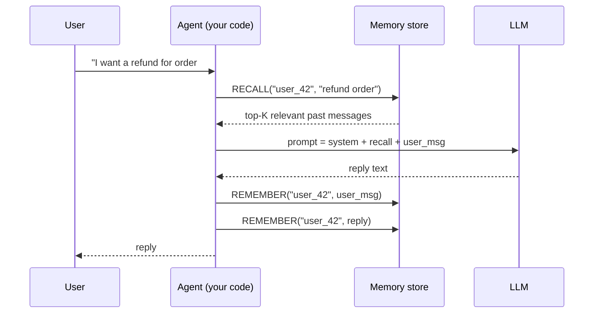
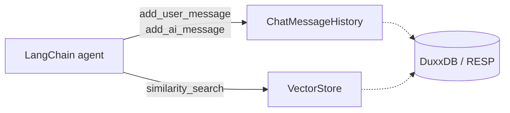
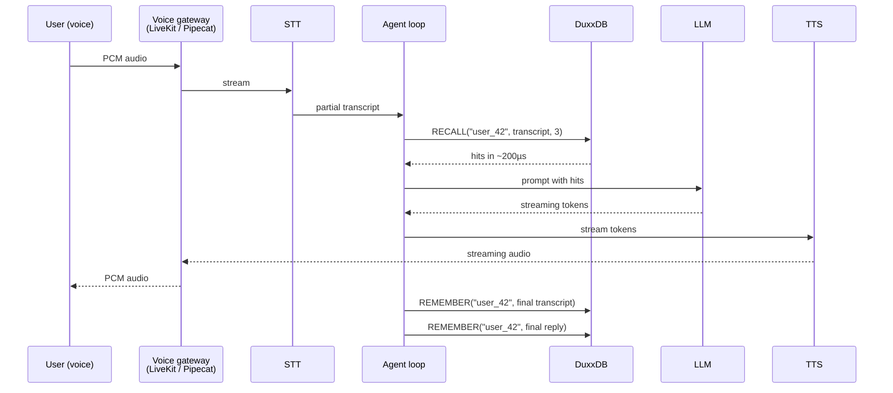
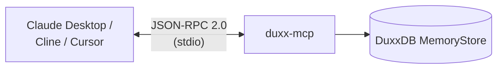
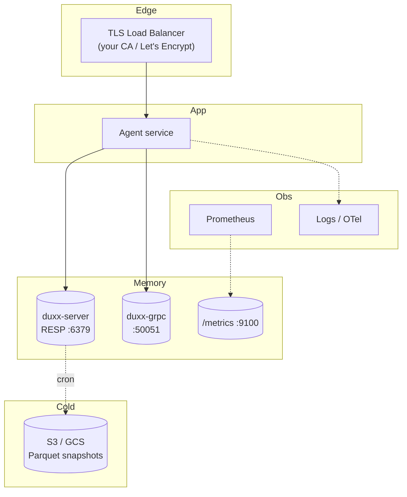
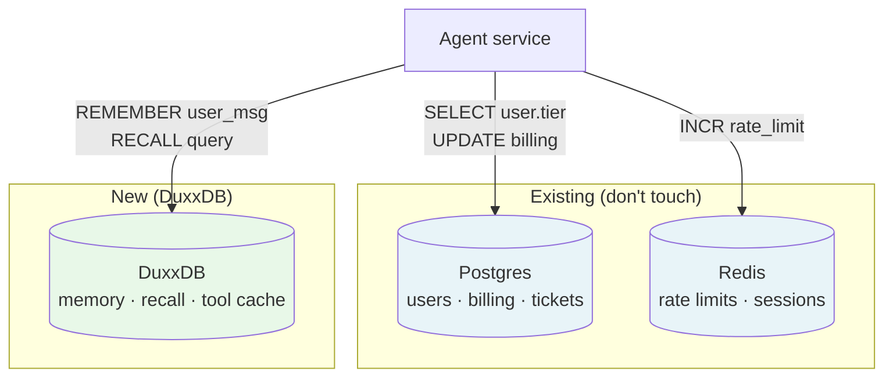
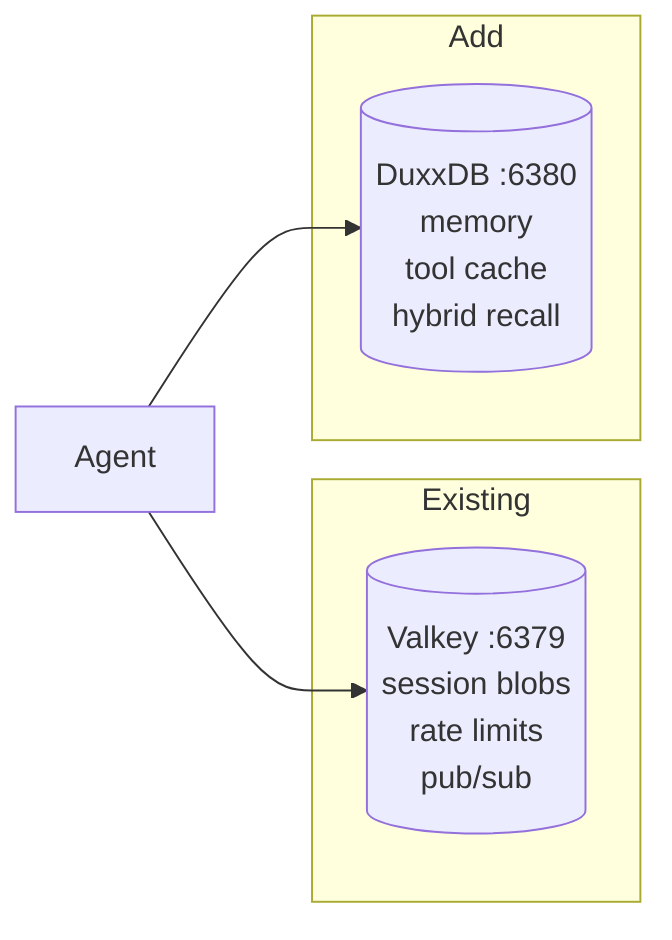
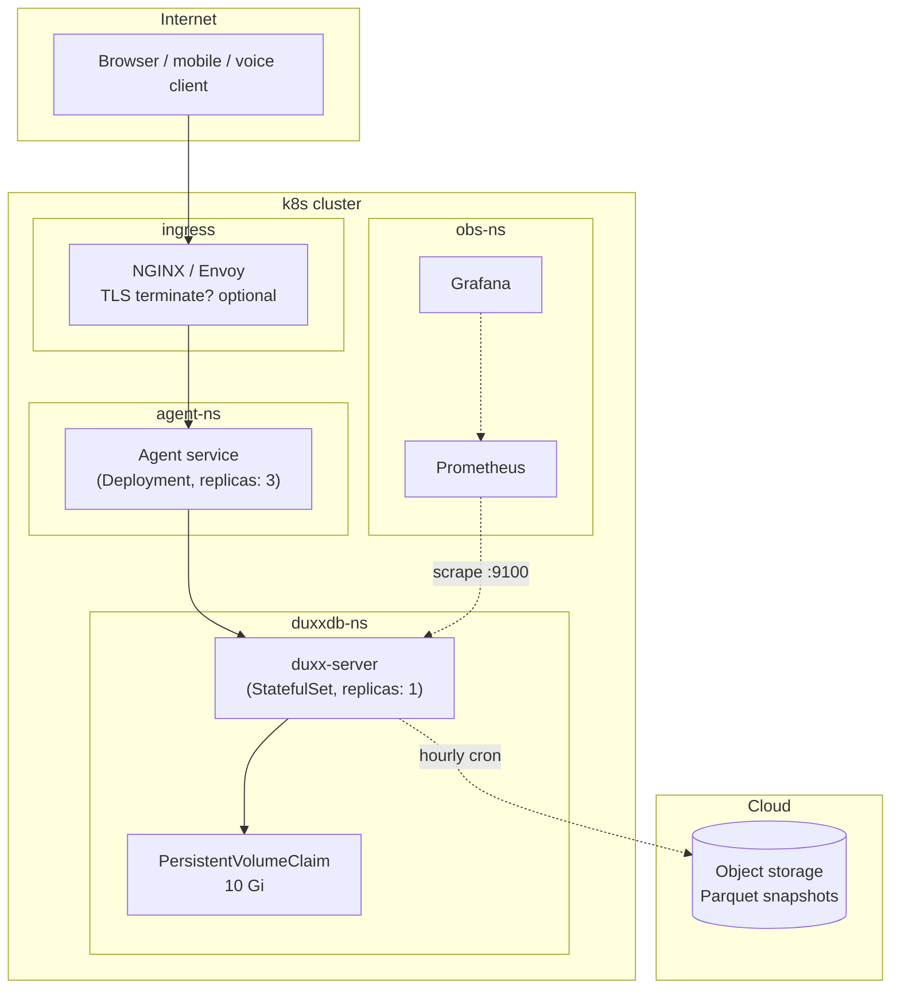
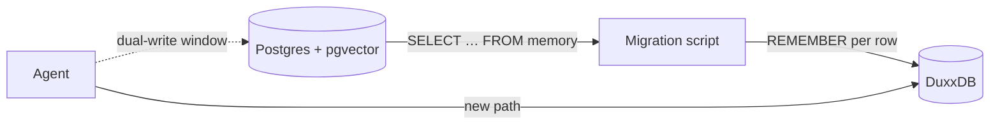
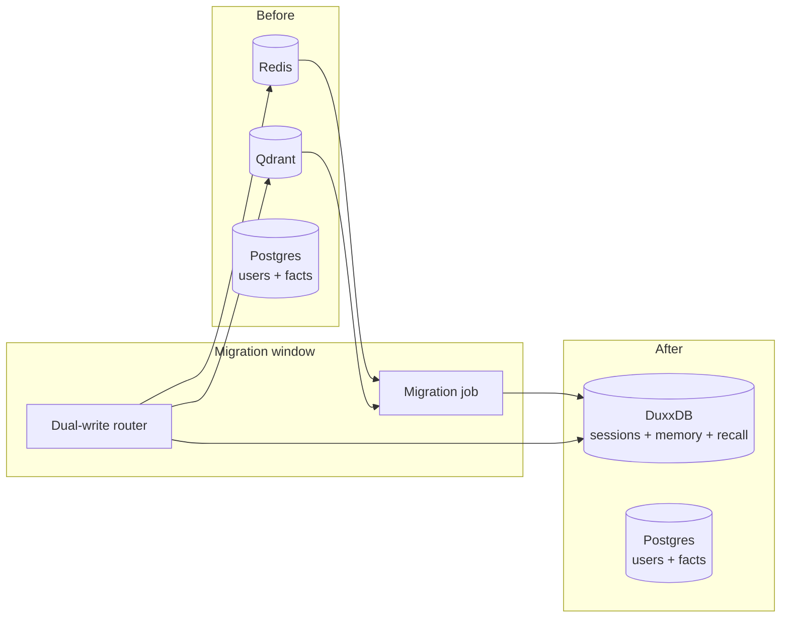

# DuxxDB — Integration Guide

How to wire DuxxDB into a real AI agent — chatbot, voice bot,
autonomous agent, or a coexistence pattern with your existing
Postgres / Redis / vector DB.

> **Mental model:** DuxxDB is the **memory layer** beneath your agent.
> It owns long-term recall, tool caching, and session state. It does
> not own users / billing / SQL analytics — keep Postgres for that.

---

## Table of contents

- [The Duxx Stack — duxx-ai + DuxxDB](#the-duxx-stack--duxx-ai--duxxdb) ★ start here for Python users
- [The 30-second mental model](#the-30-second-mental-model)
- **Wiring recipes**
  - [1. Hello, agent (Python, no framework)](#1-hello-agent-python-no-framework)
  - [2. Chatbot with LangChain](#2-chatbot-with-langchain)
  - [3. Chatbot with Vercel AI SDK (Node)](#3-chatbot-with-vercel-ai-sdk-node)
  - [4. Voice bot with Pipecat / LiveKit](#4-voice-bot-with-pipecat--livekit)
  - [5. MCP — Claude Desktop / Cline / Cursor](#5-mcp--claude-desktop--cline--cursor)
- **Architectures**
  - [Single-store agent (greenfield)](#single-store-agent-greenfield)
  - [Coexistence: keep Postgres + add DuxxDB](#coexistence-keep-postgres--add-duxxdb)
  - [Coexistence with Redis / Valkey](#coexistence-with-redis--valkey)
  - [Production reference architecture (Kubernetes)](#production-reference-architecture-kubernetes)
- **Migrations**
  - [pgvector → DuxxDB](#migration-pgvector--duxxdb)
  - [Pinecone → DuxxDB](#migration-pinecone--duxxdb)
  - [Qdrant → DuxxDB](#migration-qdrant--duxxdb)
  - [Redis + Qdrant + Postgres → DuxxDB](#migration-three-stores--one)

---

## The Duxx Stack — duxx-ai + DuxxDB

For Python developers building agents, **the fastest path is the Duxx
Stack:**
[`duxx-ai`](https://github.com/bankyresearch/duxx-ai) as the framework,
DuxxDB as the storage + retrieval engine underneath.

```mermaid
flowchart TB
    subgraph App["Your application (Python)"]
        A["from duxx_ai import Agent, Crew, MemoryManager"]
    end

    subgraph DA["duxx-ai (pip install duxx-ai)"]
        AG["Agents · Crew · Graph"]
        TL["40+ Tools (email, calendar, DB, API, ...)"]
        ME["MemoryManager (5-tier)"]
        GV["Governance · RBAC · Guardrails"]
        OB["Observability (Tracer, Evaluator)"]
        RR["Adaptive Router · Fine-tune"]
    end

    subgraph DB["DuxxDB (pip install duxxdb)"]
        MS["MemoryStore (hybrid recall)"]
        TC["ToolCache (semantic-near-hit)"]
        SS["SessionStore"]
        TS["TraceStore (Phase 7.1)"]
        PR["PromptRegistry (Phase 7.2)"]
        EV["EvalStore (Phase 7.4)"]
        CL["CostLedger (Phase 7.6)"]
    end

    A --> AG
    AG --> ME
    AG --> TL
    AG --> GV
    AG --> OB
    AG --> RR
    ME -.->|backend=DuxxBackend| MS
    TL -.->|cache=DuxxBackend|   TC
    ME -.->|sessions|            SS
    OB -.->|traces (planned)|    TS
    OB -.->|evals (planned)|     EV
    RR -.->|cost ledger (planned)| CL
```

### Why pair them

|  | duxx-ai alone | DuxxDB alone | duxx-ai + DuxxDB |
|---|---|---|---|
| Agent orchestration | ✅ | (use any framework) | ✅ |
| Multi-tier memory | ✅ in-memory + JSON files | ✅ persistent + hybrid recall | ✅ persistent + agent-aware |
| Sub-ms recall | ✗ Python dicts only | ✅ HNSW + BM25 + RRF | ✅ |
| Survives restart | only with manual save | ✅ `dir:` backend | ✅ |
| MCP server (Claude Desktop) | ✗ | ✅ | ✅ via DuxxDB |
| TLS + auth + Prometheus | ✗ | ✅ Phase 6.2 | ✅ |
| OTLP traces (planned) | basic Python tracer | ✅ Phase 7.1 | ✅ |
| Enterprise governance | ✅ guardrails + RBAC | (token auth only) | ✅ both layers |

### Quickstart — Duxx Stack hello-agent

```python
# pip install duxx-ai duxxdb
from duxx_ai import Agent
from duxx_ai.memory import MemoryManager
# When the DuxxBackend lands in duxx-ai (~this week):
# from duxx_ai.memory.storage import DuxxBackend
# memory = MemoryManager(backend=DuxxBackend(dim=1536,
#                                            storage="dir:./.duxxdb"))

# Today's path -- direct DuxxDB use from duxx-ai:
import duxxdb
store = duxxdb.MemoryStore(dim=1536)

agent = Agent(
    name="support_agent",
    instructions="You are a refund-support agent.",
    memory=store,                # <- DuxxDB is the memory backend
)

reply = agent.run("I want a refund for order #9910")
print(reply)
```

After the `DuxxBackend` swap-in ships in duxx-ai, the line becomes
one configuration call and you get persistence + hybrid recall + decay
+ eviction for free.

### Operationally

```bash
# Run DuxxDB as the shared storage daemon for a fleet of agents:
docker run -d --name duxxdb -p 6379:6379 \
  -v duxxdb-data:/var/lib/duxxdb \
  -e DUXX_STORAGE=dir:/var/lib/duxxdb \
  -e DUXX_TOKEN="$(openssl rand -hex 32)" \
  ghcr.io/bankyresearch/duxxdb:latest

# All duxx-ai workers point at the same daemon:
export DUXXDB_URL="redis://:<token>@duxxdb:6379"
python my_agent_worker.py
```

Same setup scales: one daemon serves N agents, all with persistent
shared memory, audit-traceable RBAC, and the standard ops surface.

---

---

## The 30-second mental model

Every AI agent does roughly the same thing on every turn:



**The memory store** in that diagram is the part DuxxDB is. Three
calls per turn:

| Call | What it does |
|---|---|
| `RECALL key query k` | top-k hybrid (vector + BM25) hits, filtered by user/agent key, optionally re-ranked by importance decay |
| `REMEMBER key text` | insert; auto-embeds + indexes + publishes a change event |
| `SUBSCRIBE` / `PSUBSCRIBE` | (optional) stream change events to a supervisor / analytics pipeline |

That's it. Every recipe below is a variation on those three calls.

---

## Wiring recipes

### 1. Hello, agent (Python, no framework)

Smallest possible agent. Talks to OpenAI for generation; uses DuxxDB
over RESP for memory. ~30 lines.

```python
# pip install redis openai
import os, redis
from openai import OpenAI

duxx = redis.Redis(host="localhost", port=6379, decode_responses=True,
                   password=os.environ.get("DUXX_TOKEN"))
llm  = OpenAI()  # OPENAI_API_KEY in env

def turn(user_id: str, user_msg: str) -> str:
    # 1. recall what we remember about this user
    hits = duxx.execute_command("RECALL", user_id, user_msg, 5)
    context = "\n".join(h[2] for h in hits)  # h = (id, score, text)

    # 2. ask the model
    reply = llm.chat.completions.create(
        model="gpt-4o-mini",
        messages=[
            {"role": "system", "content": f"Past context:\n{context}"},
            {"role": "user",   "content": user_msg},
        ],
    ).choices[0].message.content

    # 3. remember both sides
    duxx.execute_command("REMEMBER", user_id, f"USER: {user_msg}")
    duxx.execute_command("REMEMBER", user_id, f"ASSISTANT: {reply}")
    return reply

# Try it
print(turn("alice", "I want a refund for order #9910"))
print(turn("alice", "what was that order number again?"))
```

The second turn correctly recalls "order #9910" because the first
turn put it in the store. No framework, no prompt-engineering
gymnastics.

---

### 2. Chatbot with LangChain

LangChain is library-level; DuxxDB is the **store underneath**.
Two adapter points cover most use cases:



- **`ChatMessageHistory`** → use the built-in `RedisChatMessageHistory`
  pointing at DuxxDB (it speaks RESP, so no code change needed).
- **`VectorStore`** → use the LangChain `Redis` vector store the same
  way (RESP-compatible).

```python
# pip install langchain langchain-community langchain-openai redis
from langchain_community.chat_message_histories import RedisChatMessageHistory
from langchain_community.vectorstores.redis import Redis
from langchain_openai import OpenAIEmbeddings, ChatOpenAI

DUXX_URL = "redis://:" + os.environ["DUXX_TOKEN"] + "@localhost:6379"

# Chat history (sessions): drop-in.
history = RedisChatMessageHistory(session_id="alice", url=DUXX_URL)

# Vector store (long-term memory): also drop-in.
embeddings = OpenAIEmbeddings(model="text-embedding-3-small")
vec_store  = Redis(redis_url=DUXX_URL, index_name="memory",
                   embedding=embeddings)

# Use them in any LangChain chain / agent like you normally would.
```

You get LangChain's ecosystem (RetrievalQA, agents, tools) on top of
a single DuxxDB binary instead of Redis-stack + a separate vector
DB.

> **Why this works:** DuxxDB is RESP2/3 wire-compatible. Anywhere the
> docs say "Redis URL", paste a DuxxDB URL.

---

### 3. Chatbot with Vercel AI SDK (Node)

```ts
// npm install ai @ai-sdk/openai redis
import { openai } from "@ai-sdk/openai";
import { generateText } from "ai";
import { createClient } from "redis";

const duxx = createClient({
  url: `redis://:${process.env.DUXX_TOKEN}@localhost:6379`,
});
await duxx.connect();

async function turn(userId: string, userMsg: string) {
  // recall
  const hits = (await duxx.sendCommand([
    "RECALL", userId, userMsg, "5",
  ])) as Array<[number, string, string]>;
  const context = hits.map((h) => h[2]).join("\n");

  // generate
  const { text } = await generateText({
    model: openai("gpt-4o-mini"),
    system: `Past context:\n${context}`,
    prompt: userMsg,
  });

  // remember
  await duxx.sendCommand(["REMEMBER", userId, `USER: ${userMsg}`]);
  await duxx.sendCommand(["REMEMBER", userId, `ASSISTANT: ${text}`]);
  return text;
}
```

Same shape as the Python recipe. Vercel AI SDK only owns the
generation step.

---

### 4. Voice bot with Pipecat / LiveKit

Voice is the killer use case for DuxxDB because the **total turn
budget is ~200 ms** end-to-end. Every millisecond saved on the
memory layer is one more millisecond of barge-in headroom for the
TTS engine.



The blue path on the agent loop is what you'd swap into a Pipecat
processor:

```python
# pipecat custom processor — runs INSIDE the voice loop
from pipecat.frames.frames import LLMFullResponseEndFrame, TextFrame
from pipecat.processors.frame_processor import FrameProcessor
import redis

class DuxxMemory(FrameProcessor):
    def __init__(self, user_id: str, duxx: redis.Redis):
        super().__init__()
        self.user_id = user_id
        self.duxx = duxx
        self._last_user = ""

    async def process_frame(self, frame, direction):
        if isinstance(frame, TextFrame) and direction.name == "DOWNSTREAM":
            # User said something; recall before LLM call.
            self._last_user = frame.text
            hits = self.duxx.execute_command("RECALL", self.user_id, frame.text, 3)
            if hits:
                context = "\n".join(h[2] for h in hits)
                yield TextFrame(text=f"[memory]\n{context}\n[/memory]\n{frame.text}")
                return
        if isinstance(frame, LLMFullResponseEndFrame):
            # LLM finished speaking; remember the turn.
            self.duxx.execute_command("REMEMBER", self.user_id, f"USER: {self._last_user}")
            self.duxx.execute_command("REMEMBER", self.user_id, f"BOT: {frame.text}")
        await self.push_frame(frame, direction)
```

Drop this processor between STT and LLM. Total memory-layer
contribution to the turn: < 1 ms on a warm cache.

---

### 5. MCP — Claude Desktop / Cline / Cursor

DuxxDB ships an MCP stdio server (`duxx-mcp`). Any MCP client gets
`remember`, `recall`, and `stats` tools for free — no glue code.



#### Claude Desktop

Edit `claude_desktop_config.json`:

```jsonc
{
  "mcpServers": {
    "duxxdb": {
      "command": "/usr/local/bin/duxx-mcp",
      "args": ["--storage", "dir:/Users/me/.duxxdb"],
      "env": {
        "RUST_LOG": "info"
      }
    }
  }
}
```

Restart Claude Desktop. The new tools (`remember`, `recall`,
`stats`) appear in the tool picker. Claude can now retain context
across sessions.

#### Cline / Cursor

Same JSON, in their respective MCP config locations. The MCP
protocol is identical.

---

## Architectures

### Single-store agent (greenfield)

The simplest production architecture. One DuxxDB daemon owns
everything agent-related.



**Phase 6.2** means DuxxDB can sit directly behind the LB with
native TLS — no nginx / Envoy / sidecar required. See the
[Public-internet checklist](USER_GUIDE.md#public-internet-checklist-phase-62-ready)
for the exact flag set.

---

### Coexistence: keep Postgres + add DuxxDB

The most common real-world pattern. You have a Postgres for users /
billing / tickets — keep it. Add DuxxDB for the agent path only.



DuxxDB owns:
- Conversation memory across sessions.
- Tool-cache (avoid re-running a $0.05 LLM call you already ran).
- Vector + BM25 + structured filters in one query plan.

Postgres owns:
- Users, organizations, billing, tickets, audit log.
- Anything that needs ACID joins or analytics queries.

You don't migrate anything. You add one component.

---

### Coexistence with Redis / Valkey

If you already have Valkey for KV + pubsub, you can run **both** —
DuxxDB even speaks RESP, so client libraries are shared:



Same `redis-cli`, two ports. Good when you want to stage the
migration: start with DuxxDB owning only the new "agent recall"
feature, leave existing Redis traffic alone, expand DuxxDB's
responsibilities later.

---

### Production reference architecture (Kubernetes)



The `packaging/k8s/duxxdb.yaml` manifest in the repo gives you the
StatefulSet + Service + ConfigMap + Secret layout. With Phase 6.2
TLS, you can also skip the ingress termination and let DuxxDB
present its own cert directly — useful when the LLM service runs in
a separate cluster and connects out to DuxxDB.

---

## Migrations

### Migration: pgvector → DuxxDB

Source: a Postgres table with rows like `(id, text, embedding
vector(1536), metadata jsonb, created_at timestamptz)`. Target:
DuxxDB with the same dimension.



Step-by-step:

```python
# pip install psycopg redis
import psycopg, redis, json

src = psycopg.connect(os.environ["PG_URL"])
dst = redis.Redis(host="localhost", port=6379, decode_responses=True,
                  password=os.environ["DUXX_TOKEN"])

with src.cursor(name="cursor") as cur:    # server-side cursor
    cur.execute("""
      SELECT id, user_key, text, embedding::text, importance, extract(epoch from created_at)*1e9
      FROM memory
      ORDER BY id
    """)
    cur.itersize = 1000
    for row in cur:
        mid, key, text, emb_str, importance, created_ns = row
        # pgvector textual format: '[0.1,0.2,...]' — bracketed JSON.
        emb = json.loads(emb_str)
        # DuxxDB doesn't have a direct "import-with-embedding" RESP
        # command yet (Phase 6.3). For now: use embedded mode for
        # bulk import (see Rust snippet below) OR re-embed at write
        # time and let DuxxDB compute the vector via its embedder.
        dst.execute_command("REMEMBER", key, text)
```

For **lossless** import (preserve the original embeddings + ids +
created_at), use the embedded Rust crate:

```rust
use duxx_memory::MemoryStore;

let store = MemoryStore::open_at(1536, 1_000_000, "/var/lib/duxxdb")?;
for row in pg_rows {
    // direct Vec<f32> insert — no re-embed
    store.remember(&row.user_key, &row.text, row.embedding)?;
}
```

Cutover pattern:

1. **Day 0:** dual-write. Every `REMEMBER` goes to both stores.
2. **Day 1:** flip the read path to DuxxDB; keep dual-write.
3. **Day 7:** stop writing to Postgres. Drop the column.

---

### Migration: Pinecone → DuxxDB

```python
# pip install pinecone redis
from pinecone import Pinecone
import redis, os

pc = Pinecone(api_key=os.environ["PINECONE_API_KEY"])
idx = pc.Index("my-index")
dst = redis.Redis(host="localhost", port=6379, decode_responses=True,
                  password=os.environ["DUXX_TOKEN"])

# Pinecone doesn't expose a full-scan API; you'd use list+fetch.
# Most users have an external "source of truth" — re-embed from there.
for vec_id_batch in idx.list(limit=100):
    fetched = idx.fetch(vec_id_batch).vectors
    for vid, v in fetched.items():
        text = v.metadata.get("text", "")
        user = v.metadata.get("user_key", "default")
        dst.execute_command("REMEMBER", user, text)
```

---

### Migration: Qdrant → DuxxDB

```python
# pip install qdrant-client redis
from qdrant_client import QdrantClient
import redis, os

src = QdrantClient(url=os.environ["QDRANT_URL"])
dst = redis.Redis(host="localhost", port=6379, decode_responses=True,
                  password=os.environ["DUXX_TOKEN"])

points, next_offset = src.scroll(collection_name="memory", limit=1000,
                                 with_payload=True, with_vectors=True)
while points:
    for p in points:
        user = p.payload.get("user_key", "default")
        text = p.payload.get("text", "")
        dst.execute_command("REMEMBER", user, text)
    if next_offset is None:
        break
    points, next_offset = src.scroll(collection_name="memory",
                                     offset=next_offset, limit=1000,
                                     with_payload=True, with_vectors=True)
```

---

### Migration: three stores → one

Start: Redis (sessions) + Qdrant (vectors) + Postgres (facts).
End: DuxxDB owns memory + sessions + recall; Postgres keeps SQL
analytics.



Recommended sequence:

1. **Stand up DuxxDB** with `dir:` storage + auth + TLS + metrics
   (see [INSTALLATION.md](INSTALLATION.md)).
2. **Bulk import** Qdrant vectors → DuxxDB via the script above.
3. **Bulk import** Redis chat history → DuxxDB via `LRANGE` + `REMEMBER`.
4. **Switch the agent's reads** to DuxxDB (`RECALL` instead of
   Redis `LRANGE` + Qdrant search).
5. **Keep dual-writes** for one week. Compare metrics.
6. **Stop writing to Redis + Qdrant.** Decommission them.
7. **Postgres stays** — it keeps owning the SQL business path.

The dual-write router is ~50 lines: any agent message goes to both
old and new stack; reads come from one configured side. We include
a sample in [`bench/comparative/`](../bench/comparative/) showing how
both stacks are exercised on the same workload.

---

## Next steps

- Pick the recipe closest to your stack and copy the code.
- Set up the [production startup recipe](USER_GUIDE.md#production-startup-recipe).
- Wire Prometheus + a Grafana dashboard against the metrics on `:9100`.
- Schedule the [Parquet backup cron](USER_GUIDE.md#6-backup--restore).
- When you're happy: tag `v0.1.0` (or pin a SHA) and you're shipping.

Questions? Open a [Discussion](https://github.com/bankyresearch/duxxdb/discussions).
